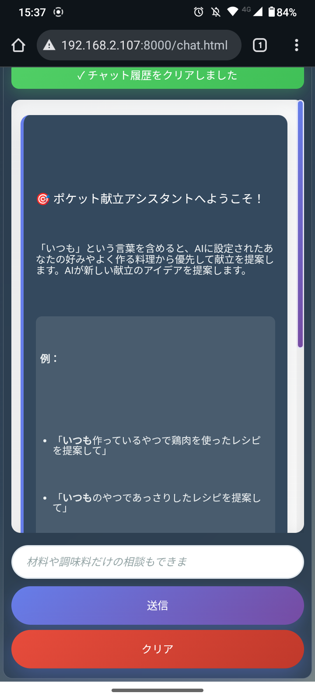
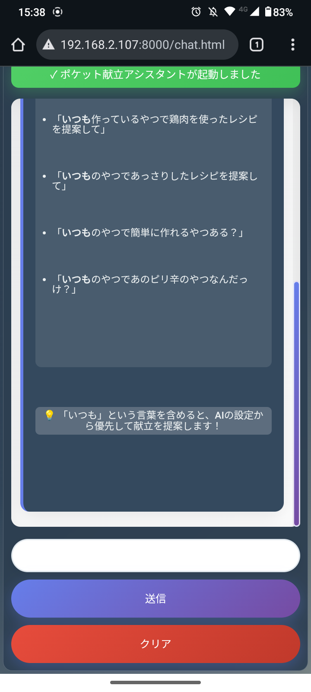
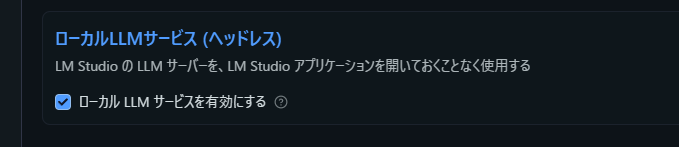

# 🍽️ Recipe SLM - 献立補助AIアシスタント
## 🎓 ポートフォリオ作品


**ローカルSLM（Small Language Model）を活用した献立提案PWAアプリケーション**

LM StudioとローカルSLM（Small Language Model）を組み合わせることで、**完全にプライベートな環境**でスマートフォンからも献立の相談ができます。

> ⚠️ **注意**: これはポートフォリオ・学習目的の作品です。個人利用を想定しており、商用利用は想定しておりません。

## 📸 プロジェクトレジュメ

### 実機の様子

**デモ動画**: [YouTube で視聴](https://youtube.com/shorts/aHcy0FfQDBA?feature=share)

### パフォーマンス

| 項目 | 性能 |
|------|------|
| レスポンス速度 | ローカルSLMに依存 |
| 対応デバイス | スマートフォン・タブレット・PC |
| オフライン利用 | 完全対応（PWA） |
| プライバシー | 完全ローカル処理 |

## 🎯 プロジェクト概要

LM StudioとローカルSLM（Small Language Model）を組み合わせた**完全プライベート**な献立提案システムです。

**ローカルLLM活用**の実践例として、プライバシーを重視しながらAI技術を日常生活に取り入れる可能性を実証したプロジェクトです。

### 主な機能
- **献立提案**: 食材・予算・栄養を考慮した献立提案
- **対話形式**: 自然な会話でのやり取り
- **PWA対応**: スマートフォンでアプリのように利用可能

## 🎬 デモ動画

> **実際の動作を見てみましょう！** スマートフォンでの操作感やAIとの対話の様子をご覧いただけます。

<div align="center">
  <a href="https://youtube.com/shorts/aHcy0FfQDBA?feature=share">
    
    <br>
    <strong>📺 YouTube で実機デモを視聴</strong>
  </a>
</div>

**🔥 動画で確認できるポイント:**
- ✨ ローカルLLMとのストリーミング応答
- 📱 スマートフォンでの快適な操作
- 🎨 美しいグラデーションデザイン  
- 🤖 献立特化AIの応答例

> 📺 **YouTubeで視聴**: [https://youtube.com/shorts/aHcy0FfQDBA?feature=share](https://youtube.com/shorts/aHcy0FfQDBA?feature=share)

## 📱 アプリケーション画面（スマホでの表示例）

**実際のアプリケーション画面 - スマートフォンでの美しいUI体験**

<div align="center">
  <table>
    <tr>
      <td align="center">
        
        <br/><strong>🔝 チャット画面上部</strong>
        <br/>接続テストなどの情報
      </td>
      <td align="center">
        
        <br/><strong>💬 チャット画面下部</strong>
        <br/>AI応答とメッセージ履歴
      </td>
    </tr>
  </table>
</div>

### 📐 アプリケーション画面の特徴

- **📱 レスポンシブ対応**: スマートフォンでも快適に操作可能
- **💬 チャット形式**: 直感的な対話インターフェース
- **🎨 シンプルデザイン**: 献立相談に集中できるUI
- **🌈 美しいグラデーション**: 視覚的に魅力的なデザイン

## 🚀 スマホでの使い方

### 1. ホーム画面に追加（推奨）
1. スマホのブラウザでアプリを開く
2. 「インストール」ボタンが表示されたらタップ
3. 「ホーム画面に追加」を選択
4. これでネイティブアプリのように使えます！

### 2. ブラウザから直接使用
- スマホのブラウザで直接アクセス
- レスポンシブデザインで画面サイズに対応
- チャット形式で直感的な操作

## ✨ スマートフォンでの利用機能

- **レスポンシブデザイン**: スマートフォンの画面サイズに最適化
- **PWA対応**: ホーム画面に追加してアプリのように利用
- **オフライン対応**: Service Workerによるオフライン利用可能

## 🛠️ セットアップ

### LM Studio の設定（APIサーバー）

<div align="center">
  
</div>

**⚠️ これはアプリケーション画面ではありません。APIサーバーの設定画面です。**

1. **LM Studioを起動**
2. **ローカルサーバーを開始**（通常は http://192.168.2.107:1234）
3. **ブラウザで `chat.html` を開く**
4. **「モデル一覧取得」→「接続テスト」で動作確認**

### システムプロンプトの設定例

<div align="center">
  
</div>

**⚠️ これはLM Studioの設定画面です。アプリケーション画面ではありません。**

### APIサーバーとしての設定（画面を閉じても動作継続）

<div align="center">
  
</div>

**⚠️ これはLM Studioの設定画面です。アプリケーション画面ではありません。**

この設定により、ブラウザを閉じてもバックグラウンドで動作し続けます。

## 📱 PWA機能

- ホーム画面に追加可能
- オフライン対応
- ネイティブアプリのような体験
- 自動更新

## 🎨 アプリケーションの特徴

- **美しいグラデーションデザイン**: CSS3を活用した視覚的に魅力的なUI
- **レスポンシブ対応**: デスクトップ・タブレット・スマートフォン対応
- **PWA対応**: ホーム画面に追加してアプリのように利用可能
- **ローカルAI連携**: LM StudioのSLMと連携した献立提案
- **プライバシー重視**: 全ての処理がローカル環境で完結

## 🔧 技術構成 & ローカルLLM活用

### ローカルLLM環境
- **LM Studio** - SLM (Small Language Model) 実行環境
- **献立特化プロンプト** - 料理・栄養に関する回答に特化したシステムプロンプト
- **OpenAI互換API** - 既存のOpenAI APIと同じ形式でローカルLLMを利用

### Webアプリケーション
- **HTML5 + CSS3 + JavaScript** - シンプルなWebアプリケーション構成
- **PWA対応** - Service Worker + Manifestでアプリライクな体験
- **レスポンシブデザイン** - デスクトップ・スマートフォン両対応

### システム構成
```
ブラウザ (chat.html) ←→ LM Studio Server ←→ ローカルSLM
      ↓
 Service Worker (オフライン対応)
```

### ローカルLLM活用のメリット
- **プライバシー保護**: 食事の好みや健康情報が外部に送信されない
- **オフライン利用**: インターネット接続不要で献立相談可能
- **カスタマイズ性**: システムプロンプトで日本の食文化に特化
- **コスト効率**: API利用料金不要でSLMを自由に活用


## 🌟 スマートフォンでの使用方法

- **縦画面推奨**: チャット形式に最適化された表示
- **ホーム画面に追加**: PWA機能でアプリのように利用
- **ローカル実行**: インターネット不要で献立相談可能

## 💡 ローカルLLM(SLM)活用で学んだこと

### 🤖 SLM（Small Language Model）の実用化
- **専用システムプロンプト設計**: 献立・料理分野に特化したAIアシスタントの構築
- **LM Studio活用**: ローカル環境でのSLM運用とAPI連携
- **プライバシー重視設計**: 個人の食事データを外部に送信しない安全な設計

### 🏠 ローカルAI環境の構築経験
- **LM Studioセットアップ**: SLMモデルの選定と設定
- **API統合**: OpenAI互換APIを使ったWebアプリケーション連携
- **システムプロンプト最適化**: 日本の食文化に適した回答を生成するプロンプト設計

### 📱 実用的なWebアプリケーション開発
- **PWA対応**: Service WorkerとManifestを使ったアプリライクな体験
- **レスポンシブ対応**: デスクトップ・スマートフォン両対応のUI設計
- **チャット形式UI**: 自然な対話形式でのユーザーインターフェース

### 🎯 プロジェクトの意義
- **ローカルAIの実証**: SLMを活用した実用的なアプリケーション例
- **プライバシー保護**: 個人データを外部に送信しない安全なAI活用
- **学習成果**: ローカルLLM環境の構築から実用化までの一連の流れを習得

## 🚀 今後の展開可能性

### 🤖 エッジデバイス・ロボット応用の可能性

このプロジェクトで実証した**ローカルLLM技術**は、以下のような展開が考えられます：

- **🏠 スマートデバイス統合**: Raspberry Pi等での軽量SLM動作
- **🤖 ロボット搭載**: 音声対話による料理アシスタント機能
- **📱 エッジコンピューティング**: オフライン環境での高速応答
- **🔒 プライバシー重視**: データ外部送信なしの安全なAI活用

**技術基盤**: 本プロジェクトのOpenAI互換API設計により、様々なデバイスへの移植が容易になっています。

## 📄 ライセンス・利用について

**ポートフォリオ・学習目的の作品**

このプロジェクトは技術学習・ポートフォリオ展示のために制作されたものです。  
ソースコード閲覧・技術参考は自由ですが、商用利用は想定しておりません。

## 🔧 開発環境・ツール

このプロジェクトの開発には以下のツールを使用しました：

- **LM Studio**: ローカルLLM実行環境
- **開発ツール**: VS Code, Claude Code
- **AI支援機能**: コード生成・リファクタリング

---

## 📋 開発情報

| 開発者 | tomomo086 + Claude |
|--------|-------------------|
| 開発期間 | 2025年9月 |
| バージョン | 1.0.0 |
| 開発ツール | Claude Code, LM Studio |

## 🔗 関連リンク

- [tomomo086: Github](https://github.com/tomomo086)
- [@mirai_sousiyo39: X](https://x.com/mirai_sousiyo39)

---

**作成者**: [tomomo086(@mirai_sousiyo39) + Claude]  
**最終更新**: 2025年9月3日

🤖 **AI駆動開発の実践例**

このREADMEもClaudeによるAI支援で作成されています。  
本プロジェクトは、ローカルLLMとPWA技術を組み合わせた実践として制作した作品です。

---

スマホで快適に献立を考えましょう！🍽️✨
