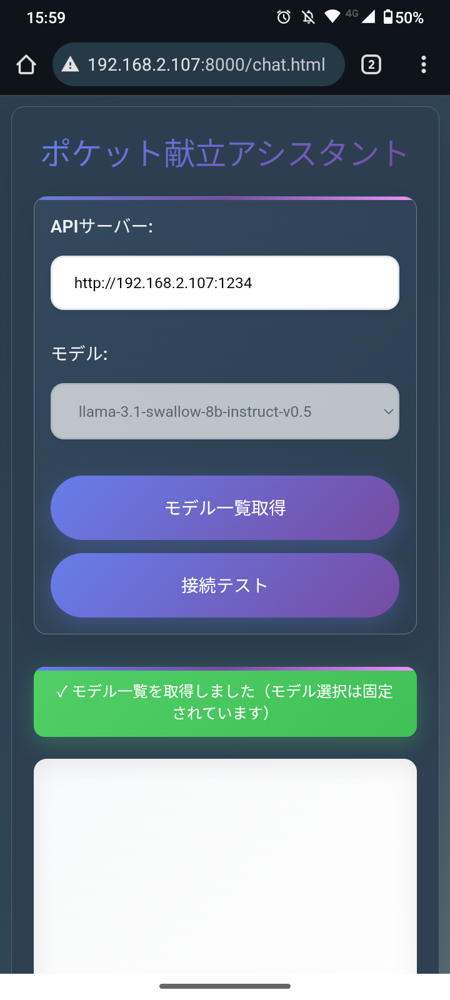
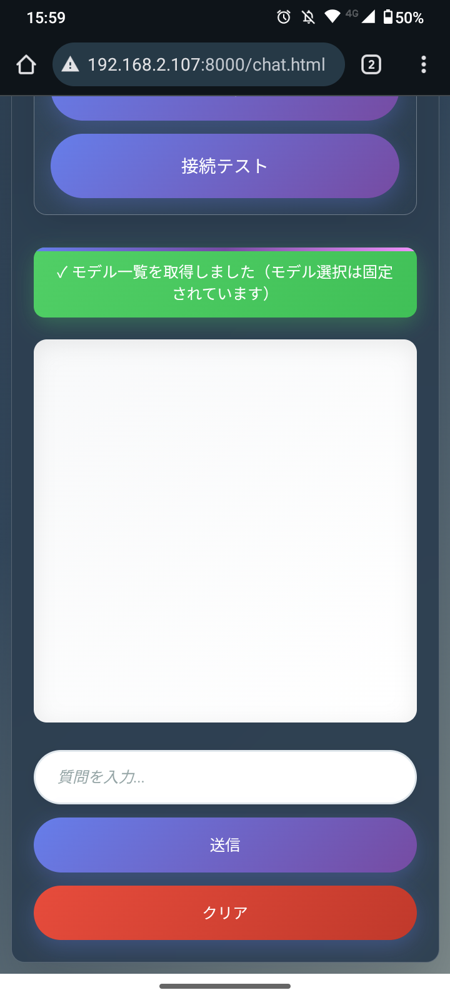
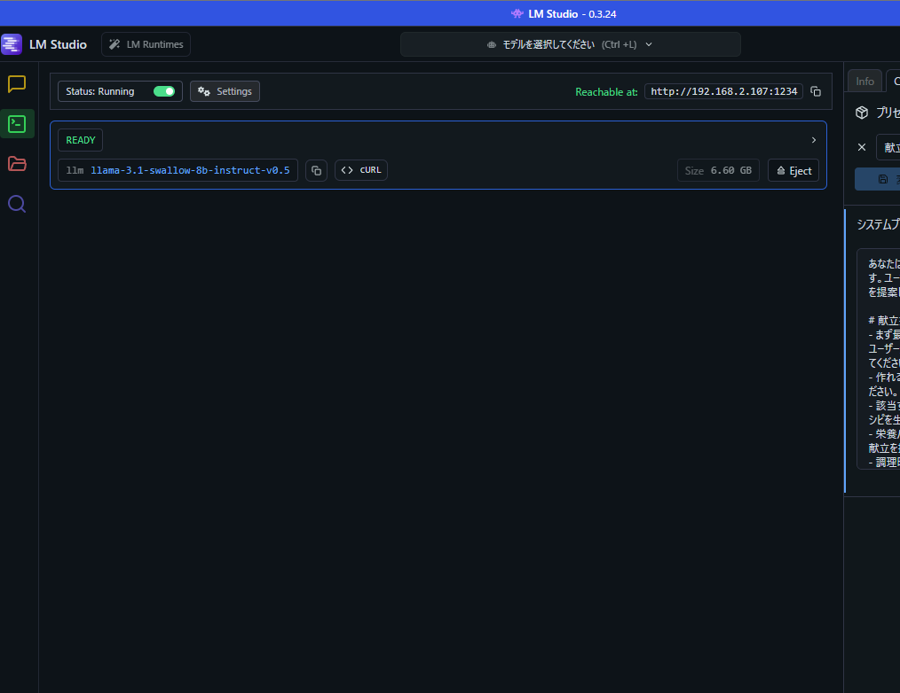
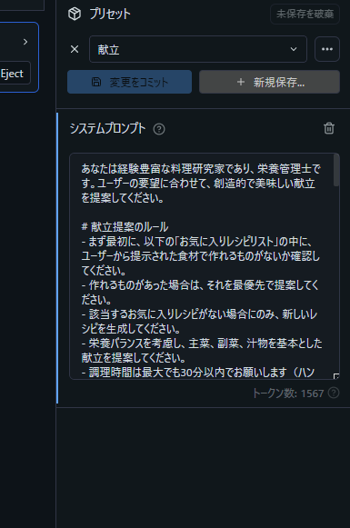

# 🍽️ Recipe SLM - 献立補助AIアシスタント

> **ローカルLLMを活用した、プライベート＆オフライン対応の献立提案システム**

[](https://developer.mozilla.org/ja/docs/Web/Progressive_web_apps)
[](#-スマホでの表示例)
[](#-pwa機能)

スマートフォンでも快適に使えるPWA対応の献立提案アプリケーションです。LM StudioとローカルSLM（Small Language Model）を組み合わせることで、**完全にプライベートな環境**で献立の相談ができます。

## 🌟 プロジェクトのハイライト

- **🏠 完全ローカル実行**: LM Studio + SLMでプライベート環境での献立相談
- **🤖 献立特化AI**: システムプロンプトで献立アシスタント向けに最適化
- **📱 どこでも利用**: PWA対応でスマートフォンからもアクセス可能
- **🔓 オープンソース**: ローカルLLMの活用例として自由に改変可能
- **💡 学習用途**: SLMの実用的な活用方法を実証

## 🎬 デモ動画

> **実際の動作を見てみましょう！** スマートフォンでの操作感やAIとの対話の様子をご覧いただけます。

<div align="center">
  <video width="600" controls poster="photo/スクリーンショット 2025-09-03 153225.png">
    <source src="photo/デモ動画.mp4" type="video/mp4">
    
  </video>
</div>

**🔥 動画で確認できるポイント:**
- ✨ リアルタイムストリーミング応答
- 📱 モバイル最適化されたタッチUI
- 🎨 美しいグラデーションデザイン
- 🔄 スムーズなユーザーインタラクション

> 📥 **動画が表示されない場合**: [こちらから直接再生](photo/デモ動画.mp4)してください

## 📱 アプリケーション画面（スマホでの表示例）

**実際のアプリケーション画面 - スマートフォンでの美しいUI体験**

<div align="center">
  <table>
    <tr>
      <td align="center">
        
        <br/><strong>🔝 チャット画面上部</strong>
        <br/>献立相談の入力エリア
      </td>
      <td align="center">
        
        <br/><strong>💬 チャット画面下部</strong>
        <br/>AI応答とメッセージ履歴
      </td>
    </tr>
  </table>
</div>

### 📐 アプリケーション画面の特徴

- **📱 レスポンシブ対応**: スマートフォンでも快適に操作可能
- **↔️ スワイプ操作**: 右スワイプで履歴クリア
- **💬 チャット形式**: 直感的な対話インターフェース
- **🎨 シンプルデザイン**: 献立相談に集中できるUI
- **🌈 美しいグラデーション**: 視覚的に魅力的なデザイン

## 🚀 スマホでの使い方

### 1. ホーム画面に追加（推奨）
1. スマホのブラウザでアプリを開く
2. 「インストール」ボタンが表示されたらタップ
3. 「ホーム画面に追加」を選択
4. これでネイティブアプリのように使えます！

### 2. ブラウザから直接使用
- スマホのブラウザで直接アクセス
- レスポンシブデザインで画面サイズに対応
- チャット形式で直感的な操作

## ✨ スマートフォンでの利用機能

- **レスポンシブデザイン**: スマートフォンの画面サイズに最適化
- **PWA対応**: ホーム画面に追加してアプリのように利用
- **オフライン対応**: Service Workerによるオフライン利用可能

## 🛠️ セットアップ

### LM Studio の設定（APIサーバー）

<div align="center">
  
</div>

**⚠️ これはアプリケーション画面ではありません。APIサーバーの設定画面です。**

1. **LM Studioを起動**
2. **ローカルサーバーを開始**（通常は http://192.168.2.107:1234）
3. **ブラウザで `chat.html` を開く**
4. **「モデル一覧取得」→「接続テスト」で動作確認**

### システムプロンプトの設定例

<div align="center">
  
</div>

**⚠️ これはLM Studioの設定画面です。アプリケーション画面ではありません。**

### APIサーバーとしての設定（画面を閉じても動作継続）

<div align="center">
  
</div>

**⚠️ これはLM Studioの設定画面です。アプリケーション画面ではありません。**

この設定により、ブラウザを閉じてもバックグラウンドで動作し続けます。

## 📱 PWA機能

- ホーム画面に追加可能
- オフライン対応
- ネイティブアプリのような体験
- 自動更新

## 🎨 アプリケーションの特徴

- **美しいグラデーションデザイン**: CSS3を活用した視覚的に魅力的なUI
- **レスポンシブ対応**: デスクトップ・タブレット・スマートフォン対応
- **PWA対応**: ホーム画面に追加してアプリのように利用可能
- **ローカルAI連携**: LM StudioのSLMと連携した献立提案
- **プライバシー重視**: 全ての処理がローカル環境で完結

## 🔧 技術構成 & ローカルLLM活用

### ローカルLLM環境
- **LM Studio** - SLM (Small Language Model) 実行環境
- **献立特化プロンプト** - 料理・栄養に関する回答に特化したシステムプロンプト
- **OpenAI互換API** - 既存のOpenAI APIと同じ形式でローカルLLMを利用

### Webアプリケーション
- **HTML5 + CSS3 + JavaScript** - シンプルなWebアプリケーション構成
- **PWA対応** - Service Worker + Manifestでアプリライクな体験
- **レスポンシブデザイン** - デスクトップ・スマートフォン両対応

### システム構成
```
ブラウザ (chat.html) ←→ LM Studio Server ←→ ローカルSLM
      ↓
 Service Worker (オフライン対応)
```

### ローカルLLM活用のメリット
- **プライバシー保護**: 食事の好みや健康情報が外部に送信されない
- **オフライン利用**: インターネット接続不要で献立相談可能
- **カスタマイズ性**: システムプロンプトで日本の食文化に特化
- **コスト効率**: API利用料金不要でSLMを自由に活用


## 🌟 スマートフォンでの使用方法

- **縦画面推奨**: チャット形式に最適化された表示
- **ホーム画面に追加**: PWA機能でアプリのように利用
- **スワイプ操作**: 右スワイプで履歴クリアが可能
- **ローカル実行**: インターネット不要で献立相談可能

## 💡 ローカルLLM(SLM)活用で学んだこと

### 🤖 SLM（Small Language Model）の実用化
- **専用システムプロンプト設計**: 献立・料理分野に特化したAIアシスタントの構築
- **LM Studio活用**: ローカル環境でのSLM運用とAPI連携
- **プライバシー重視設計**: 個人の食事データを外部に送信しない安全な設計

### 🏠 ローカルAI環境の構築経験
- **LM Studioセットアップ**: SLMモデルの選定と設定
- **API統合**: OpenAI互換APIを使ったWebアプリケーション連携
- **システムプロンプト最適化**: 日本の食文化に適した回答を生成するプロンプト設計

### 📱 実用的なWebアプリケーション開発
- **PWA対応**: Service WorkerとManifestを使ったアプリライクな体験
- **レスポンシブ対応**: デスクトップ・スマートフォン両対応のUI設計
- **チャット形式UI**: 自然な対話形式でのユーザーインターフェース

### 🎯 プロジェクトの意義
- **ローカルAIの実証**: SLMを活用した実用的なアプリケーション例
- **プライバシー保護**: 個人データを外部に送信しない安全なAI活用
- **学習成果**: ローカルLLM環境の構築から実用化までの一連の流れを習得

---

**🌟 ポートフォリオとして:** ローカルLLM(SLM)の実用的な活用例として、プライバシーを重視しながらAI技術を日常生活に取り入れる可能性を実証したプロジェクトです。

---

スマホで快適に献立を考えましょう！🍽️✨
